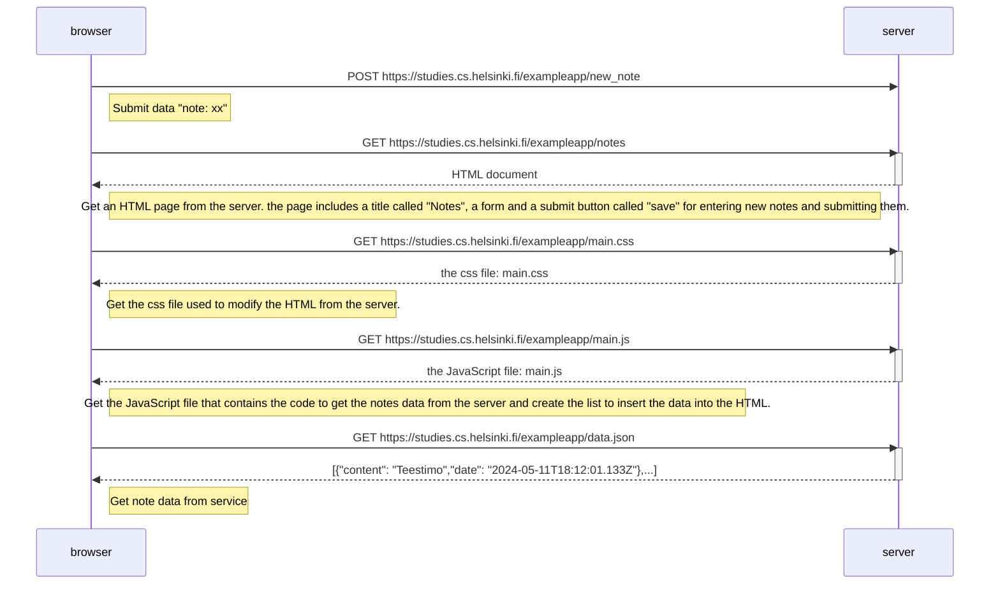

## 0.4: New note diagram

the user creates a new note on the page https://studies.cs.helsinki.fi/exampleapp/notes by writing something into the text field and clicking the Save button.

1. The user enters the submission content.
2. Clicks the submit button.
3. The page reload and displays an updated list of Notes

