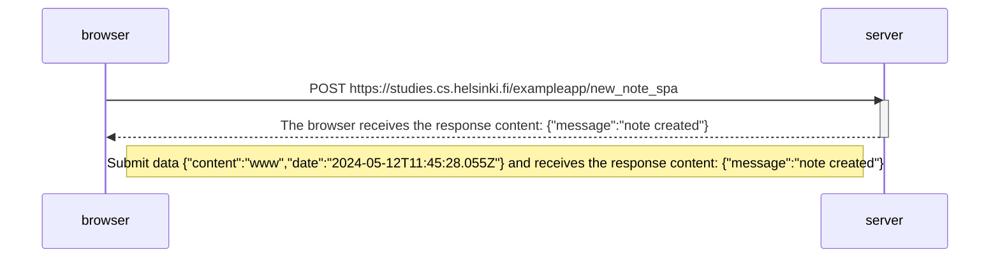

## 0.6: New note in Single page app diagram

1. The user enters the submission content.
2. Clicks the submit button.
3. The webpage is not reload, but the content is updated directly. 

```mermaid
sequenceDiagram

    participant browser
    participant server

    browser->>server: POST https://studies.cs.helsinki.fi/exampleapp/new_note_spa
    activate server
    server-->>browser: The browser receives the response content: {"message":"note created"}
    deactivate server

    Note right of browser: Submit data {"content":"www","date":"2024-05-12T11:45:28.055Z"} and receives the response content: {"message":"note created"}
```
