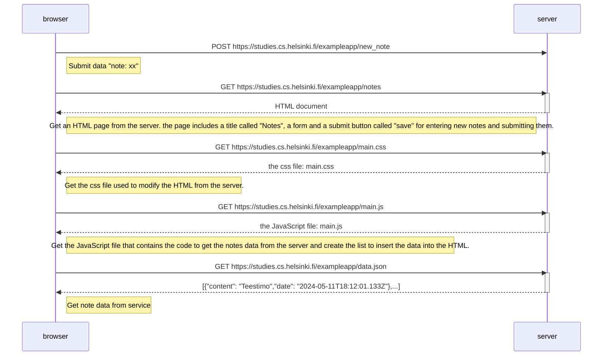
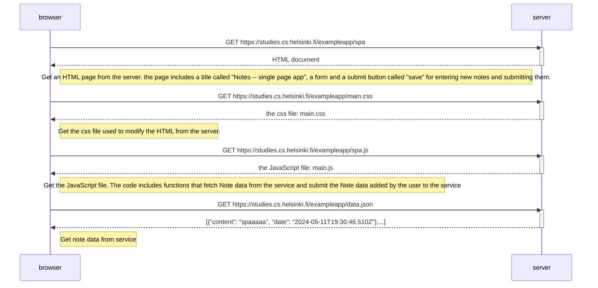
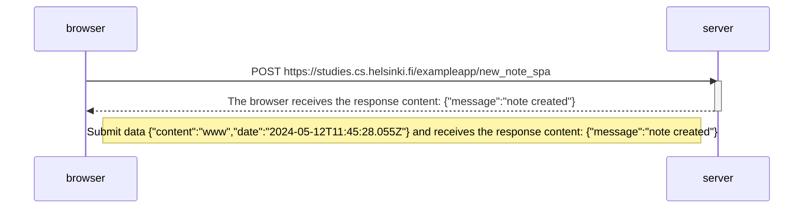

## Exercises 0.1.-0.6.
The exercises are submitted via GitHub, and by marking the exercises as done in the "my submissions" tab of the submission system.

You can submit all of the exercises into the same repository, or use multiple different repositories. If you submit exercises from different parts into the same repository, name your directories well. If you use a private repository to submit the exercises, add mluukkai as a collaborator to it.

One good way to name the directories in your submission repository is as follows:

```
part0
part1
  courseinfo
  unicafe
  anecdotes
part2
  courseinfo
  phonebook
  countriescopy
```
So, each part has its own directory, which contains a directory for each exercise set (like the unicafe exercises in part 1).

The exercises are submitted one part at a time. When you have submitted the exercises for a part, you can no longer submit any missed exercises for that part.

#### 0.1: HTML
Review the basics of HTML by reading this tutorial from Mozilla: HTML tutorial.

This exercise is not submitted to GitHub, it's enough to just read the tutorial

#### 0.2: CSS
Review the basics of CSS by reading this tutorial from Mozilla: CSS tutorial.

This exercise is not submitted to GitHub, it's enough to just read the tutorial

#### 0.3: HTML forms
Learn about the basics of HTML forms by reading Mozilla's tutorial Your first form.

This exercise is not submitted to GitHub, it's enough to just read the tutorial

## 0.4: New note diagram
In the section Loading a page containing JavaScript - review, the chain of events caused by opening the page https://studies.cs.helsinki.fi/exampleapp/notes is depicted as a sequence diagram

The diagram was made as a GitHub Markdown-file using the Mermaid-syntax, as follows:

```
sequenceDiagram
    participant browser
    participant server

    browser->>server: GET https://studies.cs.helsinki.fi/exampleapp/notes
    activate server
    server-->>browser: HTML document
    deactivate server

    browser->>server: GET https://studies.cs.helsinki.fi/exampleapp/main.css
    activate server
    server-->>browser: the css file
    deactivate server

    browser->>server: GET https://studies.cs.helsinki.fi/exampleapp/main.js
    activate server
    server-->>browser: the JavaScript file
    deactivate server

    Note right of browser: The browser starts executing the JavaScript code that fetches the JSON from the server

    browser->>server: GET https://studies.cs.helsinki.fi/exampleapp/data.json
    activate server
    server-->>browser: [{ "content": "HTML is easy", "date": "2023-1-1" }, ... ]
    deactivate server

    Note right of browser: The browser executes the callback function that renders the notescopy

```
**Create a similar diagram** depicting the situation where the user creates a new note on the page https://studies.cs.helsinki.fi/exampleapp/notes by writing something into the text field and clicking the Save button.

If necessary, show operations on the browser or on the server as comments on the diagram.

The diagram does not have to be a sequence diagram. Any sensible way of presenting the events is fine.

All necessary information for doing this, and the next two exercises, can be found in the text of this part. The idea of these exercises is to read the text once more and to think through what is going on there. Reading the application code is not necessary, but it is of course possible.

You can do the diagrams with any program, but perhaps the easiest and the best way to do diagrams is the Mermaid syntax that is now implemented in GitHub Markdown pages!

#### My solution:
##  [link](part0/0.4: New note diagram.md) 
the user creates a new note on the page https://studies.cs.helsinki.fi/exampleapp/notes by writing something into the text field and clicking the Save button.

1. The user enters the submission content.
2. Clicks the submit button.
3. The page reload and displays an updated list of Notes




## 0.5: Single page app diagram
Create a diagram depicting the situation where the user goes to the single-page app version of the notes app at https://studies.cs.helsinki.fi/exampleapp/spa.

#### My solution:
##  [link](part0/0.5: Single page app diagram.md)  
user goes to the single-page app version of the notes app at https://studies.cs.helsinki.fi/exampleapp/spa.





## 0.6: New note in Single page app diagram
Create a diagram depicting the situation where the user creates a new note using the single-page version of the app.

This was the last exercise, and it's time to push your answers to GitHub and mark the exercises as done in the submission system.

#### My solution:
##  [link](part0/0.6: New note in Single page app diagram.md) 

1. The user enters the submission content.
2. Clicks the submit button.
3. The webpage is not reload, but the content is updated directly. 


